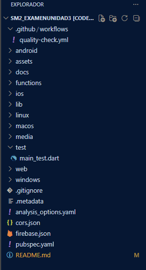
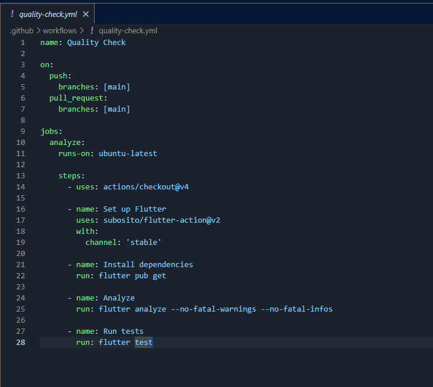
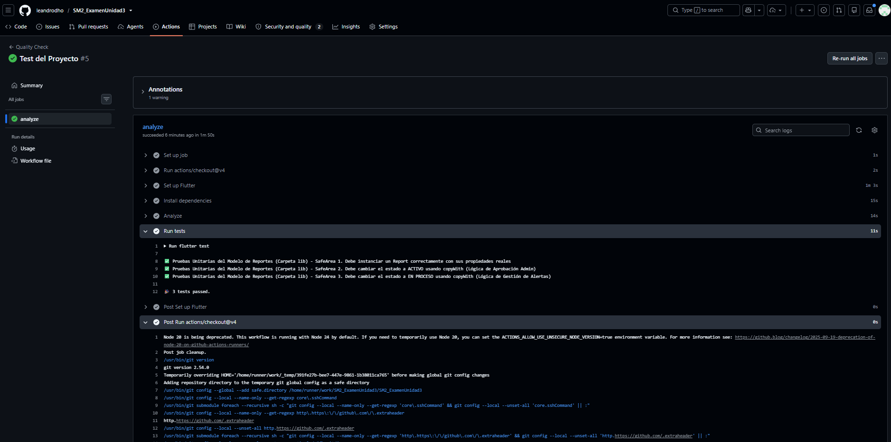

# EXAMEN PRÁCTICO – UNIDAD III

**Curso:** Desarrollo de Aplicaciones Móviles (Soluciones Móviles II)  
**Fecha:** 23 de Junio de 2026  
**Estudiante:** Leandro Diego Hurtado Ortiz  
**Institución:** Universidad Privada de Tacna (UPT)  
**Tema:** Automatización de calidad con GitHub Actions (Prácticas DevOps)  

---

## 🔗 URL del Repositorio
* **Enlace directo a GitHub:** [https://github.com/leandrodho/SM2_ExamenUnidad3](https://github.com/leandrodho/SM2_ExamenUnidad3)

---

## 🛠️ Explicación de lo Realizado

En este examen práctico se ha diseñado, configurado e implementado un flujo de trabajo (workflow) automatizado de Integración Continuo (CI) mediante la plataforma **GitHub Actions** enfocado en el aseguramiento de la calidad sobre el proyecto móvil corporativo **SafeArea**, integrando con éxito prácticas de la cultura DevOps.

### Componentes y Etapas del Flujo Automatizado:
1. **Control de Disparadores (Triggers):** El archivo de configuración de automatización está programado para reaccionar de manera inmediata ante cualquier evento de actualización de código, específicamente mediante operaciones de `push` o solicitudes de integración de código `pull_request` dirigidas a la rama principal (`main`).
2. **Aislamiento y Construcción del Entorno (Build):** Al activarse el flujo, los servidores virtuales automatizados de GitHub aprovisionan un contenedor limpio basado en el sistema operativo Linux (`ubuntu-latest`), descargan el código fuente y configuran el SDK de Flutter de manera óptima utilizando el canal de distribución estable.
3. **Resolución de Dependencias:** El entorno automatizado ejecuta la instrucción nativa `flutter pub get` para descargar y sincronizar de forma limpia todas las librerías externas del núcleo declaradas en el manifiesto del proyecto (`pubspec.yaml`).
4. **Análisis Estático de Calidad (`flutter analyze`):** Se integró una fase de escaneo estático sobre la totalidad del código fuente (carpeta `lib`). Esta etapa tiene la responsabilidad de validar el cumplimiento de las guías de estilo oficiales de Dart, convenciones arquitectónicas del framework y comprobar que el software esté libre de errores sintácticos latentes. Se configuró con tolerancias `--no-fatal-warnings` para optimizar los tiempos de integración en ambientes educativos.
5. **Ejecución de Suites de Pruebas Unitarias (`flutter test`):** Finalmente, el flujo automatizado ingresa a la sección de control e invoca de manera autónoma las pruebas unitarias programadas. Estas pruebas evalúan de forma aislada la lógica operativa crítica de transformación y actualización de estados en los modelos de datos del sistema (`Report.copyWith`), garantizando la resiliencia del software ante futuras modificaciones del código.

---

## 📸 Evidencias Fotográficas de la Implementación

### 1. Estructura de carpetas `.github/workflows/` y `test/`
Demostración de la correcta distribución de carpetas y archivos en la raíz del espacio de trabajo del proyecto móvil.

### 2. Contenido del archivo `quality-check.yml`
Visualización del código de configuración estructurado en formato YAML encargado de coordinar las fases del pipeline de DevOps.

### 3. Ejecución exitosa del workflow en la pestaña Actions (100% Passed)
Evidencia de la validación satisfactoria en los servidores de GitHub, mostrando todas las etapas completadas con éxito sin errores latentes en el repositorio.

