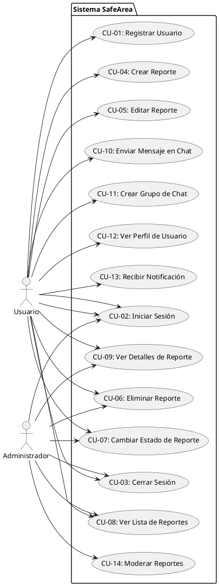

# CASOS DE USO - SafeArea

## 1. INTRODUCCIÓN

Este documento describe los casos de uso del sistema SafeArea, una aplicación móvil para reportar y gestionar incidentes de seguridad en la comunidad.

---

## 2. ACTORES DEL SISTEMA

- **Usuario**: Usuario regular que puede crear reportes, participar en chats y ver reportes de otros
- **Administrador**: Usuario con permisos especiales para moderar reportes y gestionar usuarios
- **Sistema**: Componentes internos (Firebase, notificaciones, etc.)

---

## 3. CASOS DE USO PRINCIPALES

### CU-01: Registrar Usuario

**ID**: CU-01  
**Nombre**: Registrar Usuario  
**Actor**: Usuario  
**Descripción**: Un nuevo usuario se registra en el sistema proporcionando sus datos personales.

**Precondiciones**: 
- El usuario no tiene cuenta en el sistema
- El usuario tiene acceso a internet

**Flujo Principal**:
1. El usuario abre la aplicación
2. El usuario selecciona "Registrarse"
3. El sistema muestra el formulario de registro
4. El usuario ingresa:
   - Nombre completo
   - Correo electrónico
   - Contraseña
   - Teléfono (opcional)
5. El usuario presiona "Registrarse"
6. El sistema valida los datos ingresados
7. El sistema crea la cuenta en Firebase Auth
8. El sistema crea el perfil de usuario en Firestore
9. El sistema asigna rol "user" por defecto
10. El sistema redirige al usuario a la pantalla principal
11. El caso de uso termina

**Flujos Alternativos**:
- **4a. Email inválido**: El sistema muestra error y solicita corrección
- **4b. Contraseña débil**: El sistema muestra error y solicita contraseña más segura
- **7a. Email ya existe**: El sistema muestra error indicando que el email ya está registrado

**Postcondiciones**:
- El usuario tiene una cuenta activa en el sistema
- El usuario puede iniciar sesión

**Prioridad**: Alta

---

### CU-02: Iniciar Sesión

**ID**: CU-02  
**Nombre**: Iniciar Sesión  
**Actor**: Usuario, Administrador  
**Descripción**: Un usuario autenticado inicia sesión en el sistema usando sus credenciales.

**Precondiciones**: 
- El usuario tiene una cuenta registrada en el sistema

**Flujo Principal**:
1. El usuario abre la aplicación
2. El sistema muestra la pantalla de inicio de sesión
3. El usuario ingresa:
   - Correo electrónico
   - Contraseña
4. El usuario presiona "Iniciar Sesión"
5. El sistema valida las credenciales con Firebase Auth
6. El sistema obtiene los datos del usuario desde Firestore
7. El sistema carga el perfil del usuario (rol, permisos)
8. El sistema guarda la sesión localmente
9. El sistema redirige al usuario a la pantalla principal según su rol
10. El caso de uso termina

**Flujos Alternativos**:
- **5a. Credenciales inválidas**: El sistema muestra error "Email o contraseña incorrectos"
- **5b. Usuario inactivo**: El sistema muestra error indicando que la cuenta está desactivada

**Postcondiciones**:
- El usuario está autenticado en el sistema
- La sesión está activa

**Prioridad**: Alta

---

### CU-03: Cerrar Sesión

**ID**: CU-03  
**Nombre**: Cerrar Sesión  
**Actor**: Usuario, Administrador  
**Descripción**: Un usuario autenticado cierra su sesión en el sistema.

**Precondiciones**: 
- El usuario tiene una sesión activa

**Flujo Principal**:
1. El usuario accede al menú de configuración o perfil
2. El usuario selecciona "Cerrar Sesión"
3. El sistema solicita confirmación
4. El usuario confirma
5. El sistema cierra la sesión en Firebase Auth
6. El sistema limpia los datos locales de sesión
7. El sistema redirige al usuario a la pantalla de inicio de sesión
8. El caso de uso termina

**Postcondiciones**:
- El usuario no está autenticado
- Los datos de sesión local fueron eliminados

**Prioridad**: Media

---

### CU-04: Crear Reporte

**ID**: CU-04  
**Nombre**: Crear Reporte  
**Actor**: Usuario  
**Descripción**: Un usuario crea un nuevo reporte de incidente de seguridad con información detallada e imágenes.

**Precondiciones**: 
- El usuario está autenticado
- El usuario tiene conexión a internet

**Flujo Principal**:
1. El usuario accede a la pantalla "Reportes"
2. El usuario presiona el botón "Nuevo Reporte"
3. El sistema muestra el formulario de creación de reporte
4. El usuario selecciona el tipo de incidente (Robo, Incendio, Emergencia, Accidente, Otro)
5. El usuario ingresa:
   - Título del reporte
   - Descripción detallada
   - Ubicación (texto)
6. El usuario selecciona ubicación en el mapa (opcional pero recomendado)
7. El usuario puede agregar hasta 5 imágenes:
   7.1. El usuario presiona el botón de agregar imagen
   7.2. El usuario elige fuente (Cámara o Galería)
   7.3. El usuario selecciona la imagen
   7.4. El sistema muestra previsualización
   7.5. Se repite hasta 5 imágenes máximo
8. El usuario presiona "Crear Reporte"
9. El sistema valida los datos del formulario
10. El sistema sube las imágenes a Firebase Storage
11. El sistema crea el documento del reporte en Firestore con:
    - Datos del formulario
    - URLs de las imágenes subidas
    - Coordenadas GPS (si se proporcionaron)
    - Estado inicial: "activo"
    - ID del usuario creador
12. El sistema envía notificación a todos los usuarios sobre el nuevo reporte
13. El sistema muestra mensaje de éxito
14. El sistema redirige a la lista de reportes
15. El caso de uso termina

**Flujos Alternativos**:
- **9a. Datos inválidos**: El sistema muestra errores específicos y solicita corrección
- **10a. Error al subir imágenes**: El sistema muestra error, permite reintentar o continuar sin imágenes

**Postcondiciones**:
- Se creó un nuevo reporte en el sistema
- El reporte es visible para todos los usuarios
- Las imágenes fueron almacenadas en Firebase Storage

**Prioridad**: Alta

---

### CU-05: Editar Reporte

**ID**: CU-05  
**Nombre**: Editar Reporte  
**Actor**: Usuario (Creador del reporte)  
**Descripción**: El usuario que creó un reporte puede editarlo dentro de las primeras 24 horas.

**Precondiciones**: 
- El usuario está autenticado
- El usuario es el creador del reporte
- El reporte fue creado hace menos de 24 horas

**Flujo Principal**:
1. El usuario accede a la lista de reportes
2. El usuario selecciona un reporte que creó
3. El sistema muestra los detalles del reporte
4. El usuario presiona el botón "Editar"
5. El sistema muestra el formulario prellenado con los datos actuales
6. El usuario modifica los campos deseados:
   - Tipo de incidente
   - Título
   - Descripción
   - Ubicación
   - Imágenes (puede agregar, eliminar o reemplazar)
7. El usuario presiona "Guardar Cambios"
8. El sistema valida los datos modificados
9. El sistema actualiza el documento en Firestore
10. El sistema actualiza la fecha "updatedAt"
11. El sistema muestra mensaje de éxito
12. El caso de uso termina

**Flujos Alternativos**:
- **Precondición no cumplida**: El sistema muestra mensaje indicando que el tiempo de edición expiró (más de 24 horas)
- **8a. Error al actualizar**: El sistema muestra error y permite reintentar

**Postcondiciones**:
- El reporte fue actualizado con los nuevos datos
- La fecha de actualización fue modificada

**Prioridad**: Media

---

### CU-06: Eliminar Reporte

**ID**: CU-06  
**Nombre**: Eliminar Reporte  
**Actor**: Usuario (Creador), Administrador  
**Descripción**: El creador de un reporte o un administrador elimina un reporte del sistema.

**Precondiciones**: 
- El usuario está autenticado
- El usuario es el creador del reporte O es administrador

**Flujo Principal**:
1. El usuario accede a los detalles de un reporte
2. El usuario presiona el botón "Eliminar"
3. El sistema solicita confirmación
4. El usuario confirma la eliminación
5. El sistema elimina las imágenes asociadas de Firebase Storage
6. El sistema elimina el documento del reporte de Firestore
7. El sistema muestra mensaje de éxito
8. El sistema redirige a la lista de reportes
9. El caso de uso termina

**Postcondiciones**:
- El reporte fue eliminado del sistema
- Las imágenes asociadas fueron eliminadas

**Prioridad**: Media

---

### CU-07: Cambiar Estado de Reporte

**ID**: CU-07  
**Nombre**: Cambiar Estado de Reporte  
**Actor**: Usuario (Creador), Administrador  
**Descripción**: El usuario cambia el estado de un reporte (Activo, En Proceso, Resuelto).

**Precondiciones**: 
- El usuario está autenticado
- El usuario es el creador del reporte O es administrador

**Flujo Principal**:
1. El usuario accede a los detalles de un reporte
2. El usuario presiona el botón para cambiar estado
3. El sistema muestra opciones de estado disponibles
4. El usuario selecciona el nuevo estado:
   - "Activo"
   - "En Proceso"
   - "Resuelto"
5. El sistema actualiza el estado en Firestore
6. El sistema envía notificación sobre el cambio de estado
7. El sistema muestra mensaje de éxito
8. El caso de uso termina

**Postcondiciones**:
- El estado del reporte fue actualizado
- Los usuarios fueron notificados del cambio

**Prioridad**: Media

---

### CU-08: Ver Lista de Reportes

**ID**: CU-08  
**Nombre**: Ver Lista de Reportes  
**Actor**: Usuario, Administrador  
**Descripción**: El usuario visualiza una lista de todos los reportes disponibles con opciones de filtrado.

**Precondiciones**: 
- El usuario está autenticado

**Flujo Principal**:
1. El usuario accede a la pantalla "Reportes"
2. El sistema carga los reportes desde Firestore
3. El sistema muestra la lista de reportes ordenados por fecha (más recientes primero)
4. El usuario puede aplicar filtros:
   - Por tipo de incidente
   - Por estado
5. El usuario puede seleccionar un reporte para ver detalles
6. El caso de uso termina

**Flujos Alternativos**:
- **4a. Filtro aplicado**: El sistema actualiza la lista mostrando solo los reportes que cumplen el criterio

**Postcondiciones**:
- El usuario visualiza la lista de reportes (filtrada o completa)

**Prioridad**: Alta

---

### CU-09: Ver Detalles de Reporte

**ID**: CU-09  
**Nombre**: Ver Detalles de Reporte  
**Actor**: Usuario, Administrador  
**Descripción**: El usuario visualiza la información completa de un reporte específico.

**Precondiciones**: 
- El usuario está autenticado

**Flujo Principal**:
1. El usuario accede a la lista de reportes
2. El usuario selecciona un reporte
3. El sistema muestra los detalles:
   - Tipo de incidente
   - Título
   - Descripción
   - Ubicación (si el usuario es el creador, muestra ubicación completa; si no, muestra ubicación aproximada)
   - Estado
   - Imágenes (hasta 5)
   - Fecha de creación
   - Fecha de actualización
   - Información del creador
4. Si el usuario es el creador, muestra opciones de editar/eliminar/cambiar estado
5. El usuario puede visualizar las imágenes en tamaño completo
6. El caso de uso termina

**Postcondiciones**:
- El usuario visualizó toda la información del reporte

**Prioridad**: Alta

---

### CU-10: Enviar Mensaje en Chat

**ID**: CU-10  
**Nombre**: Enviar Mensaje en Chat  
**Actor**: Usuario  
**Descripción**: Un usuario envía un mensaje de texto o con imagen a un grupo de chat.

**Precondiciones**: 
- El usuario está autenticado
- El usuario es miembro del grupo de chat

**Flujo Principal**:
1. El usuario accede a la pantalla "Chat"
2. El usuario selecciona un grupo de chat
3. El sistema carga los mensajes anteriores
4. El usuario puede:
   - Escribir un mensaje de texto, O
   - Adjuntar una imagen (opcional)
5. Si adjunta imagen:
   5.1. El usuario presiona el botón de adjuntar imagen
   5.2. El usuario elige fuente (Cámara o Galería)
   5.3. El usuario selecciona la imagen
   5.4. El sistema sube la imagen a Firebase Storage
   5.5. El sistema muestra previsualización
6. El usuario presiona "Enviar"
7. El sistema crea el mensaje en Firestore con:
   - Texto (si se proporcionó)
   - URL de imagen (si se adjuntó)
   - ID del usuario
   - Nombre del usuario
   - Timestamp
   - ID del grupo
8. El sistema envía notificación a los otros miembros del grupo
9. El mensaje aparece en tiempo real en el chat
10. El caso de uso termina

**Flujos Alternativos**:
- **5.4a. Error al subir imagen**: El sistema muestra error y permite reintentar
- **7a. Mensaje vacío**: El sistema no permite enviar si no hay texto ni imagen

**Postcondiciones**:
- El mensaje fue enviado al grupo
- Los miembros fueron notificados

**Prioridad**: Alta

---

### CU-11: Crear Grupo de Chat

**ID**: CU-11  
**Nombre**: Crear Grupo de Chat  
**Actor**: Usuario  
**Descripción**: Un usuario crea un nuevo grupo de chat personalizado.

**Precondiciones**: 
- El usuario está autenticado

**Flujo Principal**:
1. El usuario accede a la pantalla "Chat"
2. El usuario presiona el botón "Crear Grupo"
3. El sistema muestra el formulario de creación
4. El usuario ingresa:
   - Nombre del grupo
   - Descripción
   - Selecciona si es público o privado
5. El usuario presiona "Crear Grupo"
6. El sistema valida los datos
7. El sistema crea el grupo en Firestore
8. El sistema agrega al usuario creador como miembro
9. El sistema muestra mensaje de éxito
10. El usuario es redirigido al nuevo grupo
11. El caso de uso termina

**Postcondiciones**:
- Se creó un nuevo grupo de chat
- El creador es miembro del grupo

**Prioridad**: Media

---

### CU-12: Ver Perfil de Usuario

**ID**: CU-12  
**Nombre**: Ver Perfil de Usuario  
**Actor**: Usuario  
**Descripción**: El usuario visualiza y puede editar su perfil personal.

**Precondiciones**: 
- El usuario está autenticado

**Flujo Principal**:
1. El usuario accede al menú de perfil
2. El sistema muestra la información del perfil:
   - Nombre
   - Email
   - Teléfono
   - Foto de perfil (si existe)
   - Fecha de registro
   - Rol
3. El usuario puede editar:
   - Nombre
   - Teléfono
   - Foto de perfil
4. El usuario guarda los cambios
5. El sistema actualiza el perfil en Firestore
6. El sistema muestra mensaje de éxito
7. El caso de uso termina

**Postcondiciones**:
- El perfil fue actualizado (si se modificó)

**Prioridad**: Media

---

### CU-13: Recibir Notificación

**ID**: CU-13  
**Nombre**: Recibir Notificación  
**Actor**: Usuario  
**Descripción**: El usuario recibe notificaciones push sobre eventos importantes en el sistema.

**Precondiciones**: 
- El usuario está autenticado
- El usuario tiene permisos de notificaciones habilitados

**Flujo Principal**:
1. Ocurre un evento en el sistema:
   - Nuevo reporte creado
   - Cambio de estado de un reporte
   - Nuevo mensaje en un grupo de chat
2. El sistema (Cloud Function o servicio) envía notificación push
3. Si la app está en primer plano: se muestra notificación local
4. Si la app está en segundo plano: el sistema muestra notificación push
5. El usuario toca la notificación
6. El sistema abre la app en la pantalla relacionada (reporte, chat, etc.)
7. El caso de uso termina

**Flujos Alternativos**:
- **3a. Usuario desactiva notificaciones**: El sistema no envía notificaciones

**Postcondiciones**:
- El usuario fue notificado del evento

**Prioridad**: Media

---

### CU-14: Moderar Reportes (Administrador)

**ID**: CU-14  
**Nombre**: Moderar Reportes  
**Actor**: Administrador  
**Descripción**: Un administrador modera los reportes del sistema, pudiendo eliminar cualquier reporte.

**Precondiciones**: 
- El usuario está autenticado
- El usuario tiene rol "admin"

**Flujo Principal**:
1. El administrador accede a la lista de reportes
2. El sistema muestra todos los reportes (con indicadores especiales para admin)
3. El administrador selecciona un reporte
4. El administrador puede:
   - Eliminar el reporte
   - Cambiar el estado
   - Ver información completa (incluyendo ubicación exacta)
5. El administrador realiza la acción deseada
6. El sistema ejecuta la acción solicitada
7. El sistema registra la acción de moderación
8. El caso de uso termina

**Postcondiciones**:
- Se realizó la acción de moderación

**Prioridad**: Baja (funcionalidad futura)

---

## 4. DIAGRAMA DE CASOS DE USO

### Diagrama en formato texto (PlantUML):

### Diagrama en formato Mermaid:

```mermaid
graph TB
    subgraph "Actores"
        Usuario[👤 Usuario]
        Admin[👔 Administrador]
    end
    
    subgraph "Autenticación"
        CU01[CU-01: Registrar Usuario]
        CU02[CU-02: Iniciar Sesión]
        CU03[CU-03: Cerrar Sesión]
    end
    
    subgraph "Gestión de Reportes"
        CU04[CU-04: Crear Reporte]
        CU05[CU-05: Editar Reporte]
        CU06[CU-06: Eliminar Reporte]
        CU07[CU-07: Cambiar Estado]
        CU08[CU-08: Ver Lista]
        CU09[CU-09: Ver Detalles]
    end
    
    subgraph "Chat"
        CU10[CU-10: Enviar Mensaje]
        CU11[CU-11: Crear Grupo]
    end
    
    subgraph "Otros"
        CU12[CU-12: Ver Perfil]
        CU13[CU-13: Recibir Notificación]
        CU14[CU-14: Moderar Reportes]
    end
    
    Usuario --> CU01
    Usuario --> CU02
    Usuario --> CU03
    Usuario --> CU04
    Usuario --> CU05
    Usuario --> CU06
    Usuario --> CU07
    Usuario --> CU08
    Usuario --> CU09
    Usuario --> CU10
    Usuario --> CU11
    Usuario --> CU12
    Usuario --> CU13
    
    Admin --> CU02
    Admin --> CU03
    Admin --> CU06
    Admin --> CU07
    Admin --> CU08
    Admin --> CU09
    Admin --> CU14
```

---

## 5. HERRAMIENTAS PARA CREAR DIAGRAMAS DE CASOS DE USO

### 🔧 **Herramientas Recomendadas (GRATIS en línea):**

#### 1. **Draw.io / diagrams.net** ⭐ **RECOMENDADO**
- **URL**: https://app.diagrams.net o https://www.draw.io
- **Ventajas**:
  - 100% gratuito y sin límites
  - Funciona completamente en el navegador
  - Puede guardar en Google Drive, OneDrive, o local
  - Soporta exportación a PNG, PDF, SVG, etc.
  - Tiene plantillas UML predefinidas
  - Muy fácil de usar
- **Cómo usarlo**:
  1. Ve a https://app.diagrams.net
  2. Selecciona "Create New Diagram"
  3. Busca plantilla "UML Use Case" o crea desde cero
  4. Arrastra y suelta los elementos
  5. Guarda tu trabajo
  6. Exporta como PNG o PDF

#### 2. **Lucidchart** (Versión gratuita limitada)
- **URL**: https://www.lucidchart.com
- **Ventajas**:
  - Interfaz profesional
  - Buena integración con otras herramientas
  - Plantillas UML
- **Desventajas**: Versión gratuita tiene límites de elementos

#### 3. **Creately** (Versión gratuita limitada)
- **URL**: https://creately.com
- **Ventajas**:
  - Fácil de usar
  - Plantillas de UML
- **Desventajas**: Limitado en versión gratuita

#### 4. **PlantUML** (Basado en texto)
- **URL**: https://plantuml.com
- **Editor online**: http://www.plantuml.com/plantuml/uml/
- **Ventajas**:
  - Se escribe como código
  - Muy rápido para diagramas complejos
  - Se puede versionar en Git
  - Gratis y open source
- **Desventajas**: Requiere aprender sintaxis

#### 5. **Mermaid** (Basado en texto)
- **URL**: https://mermaid.live
- **Ventajas**:
  - Similar a PlantUML pero más simple
  - Se integra bien con Markdown
  - Editor en línea gratuito
- **Desventajas**: Menos opciones que PlantUML

### 📋 **Pasos para Crear tu Diagrama:**

#### **Usando Draw.io (Más fácil):**

1. **Accede a Draw.io**:
   - Ve a https://app.diagrams.net
   - O descarga la aplicación de escritorio

2. **Crea nuevo diagrama**:
   - Click en "Create New Diagram"
   - Busca "UML" o "Use Case"
   - O empieza desde "Blank Diagram"

3. **Agrega elementos UML**:
   - **Actor**: Busca "Actor" en la barra de búsqueda y arrastra
   - **Caso de Uso**: Busca "Use Case" (óvalo) y arrastra
   - **Líneas**: Usa las flechas de la barra de herramientas

4. **Organiza tu diagrama**:
   - Agrega los actores (Usuario, Administrador)
   - Agrega los casos de uso como óvalos
   - Conecta con flechas (líneas simples)

5. **Agrupa con paquetes**:
   - Usa formas de rectángulo para crear paquetes
   - Etiqueta cada grupo (Autenticación, Reportes, Chat, etc.)

6. **Exporta**:
   - Archivo → Exportar como → PNG (para imágenes)
   - Archivo → Exportar como → PDF (para documentos)

#### **Usando PlantUML (Más rápido si conoces sintaxis):**

1. **Accede al editor**:
   - Ve a http://www.plantuml.com/plantuml/uml/
   - O instala extensión en VS Code: "PlantUML"

2. **Copia el código PlantUML** de la sección 4 de este documento

3. **Pega en el editor**

4. **Ajusta según necesites**

5. **Exporta como PNG o SVG**

---

## 6. INSTRUCCIONES PARA COPIAR AL DOCUMENTO

1. **Abre tu editor de documentos** (Word, Google Docs, etc.)

2. **Copia las secciones de texto**:
   - Sección 1: Introducción
   - Sección 2: Actores
   - Sección 3: Casos de Uso (cada uno completo)

3. **Para los diagramas**:
   - **Opción A**: Crea el diagrama en Draw.io y exporta como PNG, luego inserta la imagen
   - **Opción B**: Usa el código PlantUML/Mermaid y genera la imagen

4. **Formatea según tu estilo**:
   - Usa numeración automática
   - Aplica estilos de títulos
   - Asegúrate de mantener la estructura

5. **Revisa la numeración** de los casos de uso (CU-01, CU-02, etc.)

---

## 7. TABLA RESUMEN DE CASOS DE USO

| ID | Nombre | Actor | Prioridad | Estado |
|----|--------|-------|-----------|--------|
| CU-01 | Registrar Usuario | Usuario | Alta | ✅ Implementado |
| CU-02 | Iniciar Sesión | Usuario, Admin | Alta | ✅ Implementado |
| CU-03 | Cerrar Sesión | Usuario, Admin | Media | ✅ Implementado |
| CU-04 | Crear Reporte | Usuario | Alta | ✅ Implementado |
| CU-05 | Editar Reporte | Usuario | Media | ✅ Implementado |
| CU-06 | Eliminar Reporte | Usuario, Admin | Media | ✅ Implementado |
| CU-07 | Cambiar Estado de Reporte | Usuario, Admin | Media | ✅ Implementado |
| CU-08 | Ver Lista de Reportes | Usuario, Admin | Alta | ✅ Implementado |
| CU-09 | Ver Detalles de Reporte | Usuario, Admin | Alta | ✅ Implementado |
| CU-10 | Enviar Mensaje en Chat | Usuario | Alta | ✅ Implementado |
| CU-11 | Crear Grupo de Chat | Usuario | Media | ✅ Implementado |
| CU-12 | Ver Perfil de Usuario | Usuario | Media | ✅ Implementado |
| CU-13 | Recibir Notificación | Usuario | Media | ✅ Implementado |
| CU-14 | Moderar Reportes | Administrador | Baja | 🚧 Futuro |

---

**Fecha de creación**: 2024  
**Versión del documento**: 1.0  
**Autor**: Equipo de Desarrollo SafeArea

