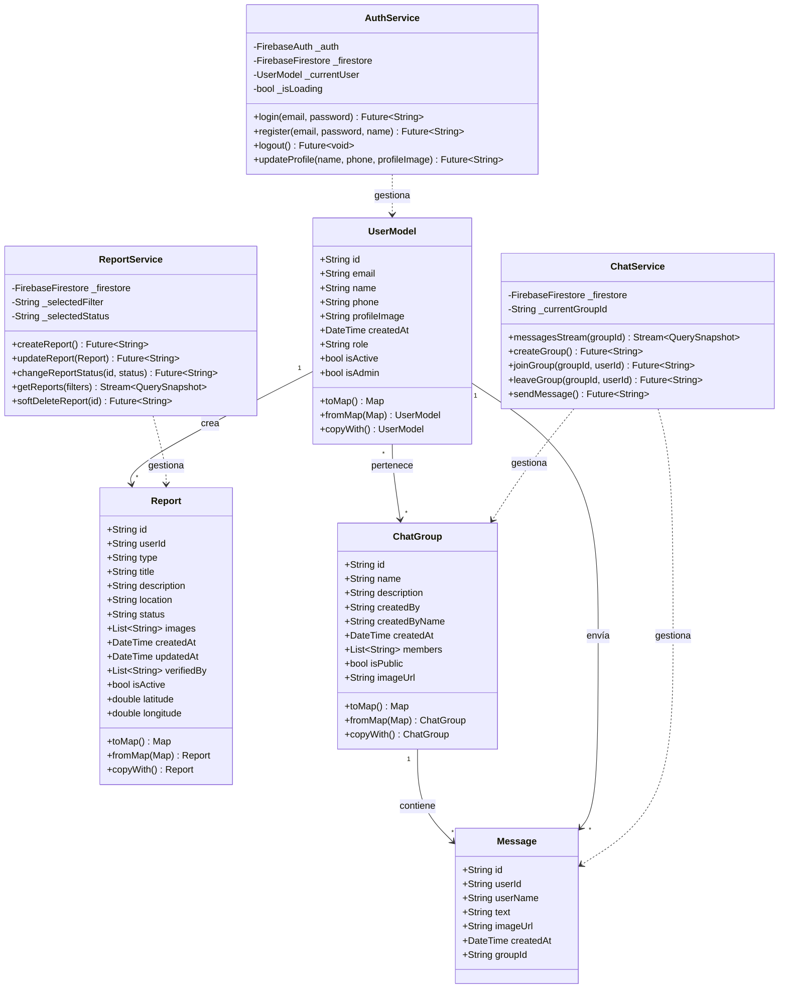
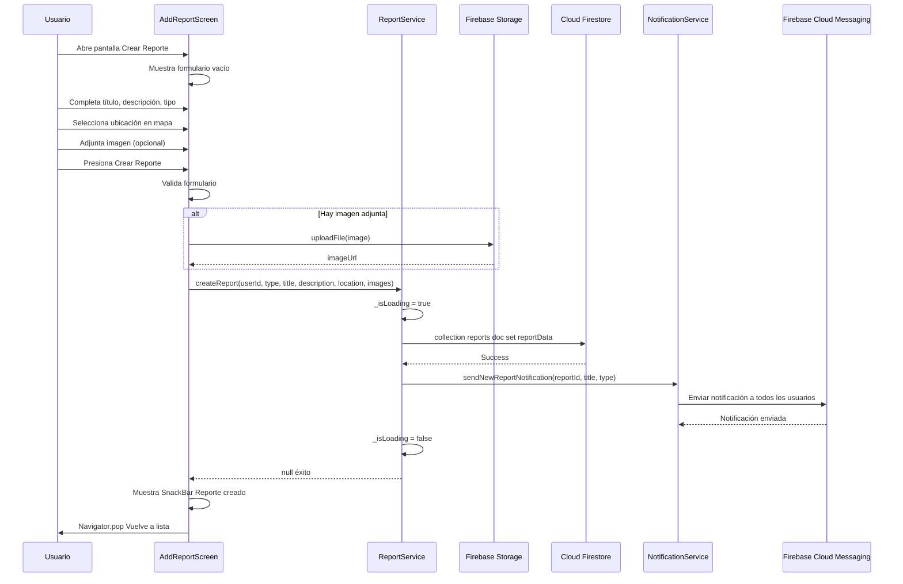
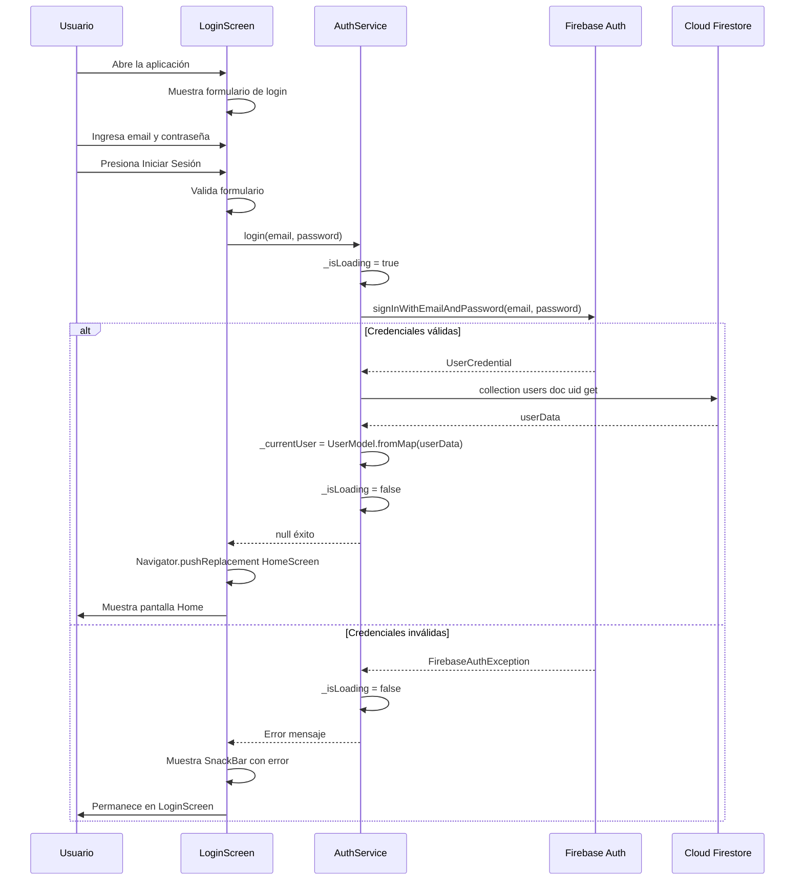
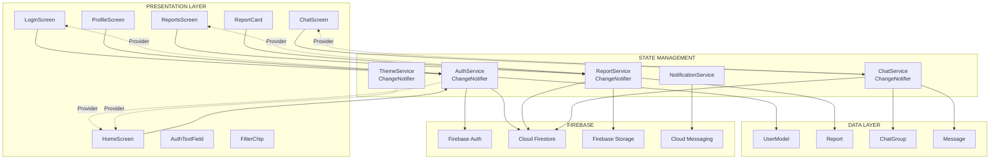
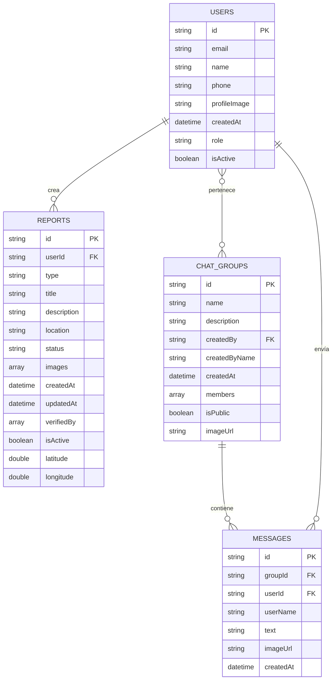

# DIAGRAMAS MERMAID - PROYECTO SAFEAREA

Copia cada bloque de código y pégalo en [mermaid.live](https://mermaid.live) para generar el diagrama.

---

## 1. DIAGRAMA DE CASOS DE USO

```mermaid
graph TB
    subgraph Actores
        U["👤 Usuario"]
        A["👨‍💼 Administrador"]
    end

    subgraph "Módulo Autenticación"
        RF01["RF-01: Registrarse"]
        RF02["RF-02: Iniciar Sesión"]
        RF03["RF-03: Cerrar Sesión"]
        RF04["RF-04: Gestionar Perfil"]
    end

    subgraph "Módulo Reportes"
        RF05["RF-05: Crear Reporte"]
        RF06["RF-06: Categorizar Reporte"]
        RF07["RF-07: Cambiar Estado"]
        RF08["RF-08: Editar Reporte"]
        RF09["RF-09: Ver Listado Reportes"]
        RF10["RF-10: Ver Detalle Reporte"]
        RF11["RF-11: Adjuntar Imágenes"]
    end

    subgraph "Módulo Chat"
        RF12["RF-12: Chat por Zonas"]
        RF13["RF-13: Crear Grupo"]
        RF14["RF-14: Enviar Mensajes"]
        RF15["RF-15: Unirse/Salir Grupo"]
        RF16["RF-16: Chat Privado"]
    end

    subgraph "Módulo Administración"
        RF17["RF-17: Ver Dashboard"]
        RF18["RF-18: Gestionar Usuarios"]
        RF19["RF-19: Moderar Reportes"]
        RF20["RF-20: Eliminar Reportes"]
    end

    subgraph "Módulo Configuración"
        RF24["RF-24: Config. Notificaciones"]
        RF25["RF-25: Cambiar Tema"]
    end

    %% Conexiones Usuario
    U --> RF01
    U --> RF02
    U --> RF03
    U --> RF04
    U --> RF05
    U --> RF08
    U --> RF09
    U --> RF10
    U --> RF11
    U --> RF12
    U --> RF13
    U --> RF14
    U --> RF15
    U --> RF16
    U --> RF24
    U --> RF25

    %% Conexiones Administrador
    A --> RF01
    A --> RF02
    A --> RF03
    A --> RF04
    A --> RF05
    A --> RF09
    A --> RF10
    A --> RF17
    A --> RF18
    A --> RF19
    A --> RF20

    %% Relaciones include
    RF05 -.->|include| RF06
    RF05 -.->|include| RF11
```



---

## 2. DIAGRAMA DE CLASES / ENTIDAD-RELACIÓN



---

## 3. DIAGRAMA DE SECUENCIA - CREAR REPORTE



---

## 4. DIAGRAMA DE SECUENCIA - LOGIN



---

## 5. DIAGRAMA DE ARQUITECTURA



---

## 6. DIAGRAMA ENTIDAD-RELACIÓN (BASE DE DATOS)



---

## Instrucciones de Uso

1. **Copiar el código**: Selecciona todo el contenido dentro del bloque de código (entre los \`\`\`mermaid y \`\`\`)

2. **Ir a Mermaid Live**: Abre [https://mermaid.live](https://mermaid.live)

3. **Pegar el código**: Pega el código en el editor de la izquierda

4. **Exportar**: Usa los botones de exportación para descargar como:
   - PNG (imagen)
   - SVG (vectorial)
   - PDF

5. **Incluir en LaTeX**: Para incluir en el documento LaTeX:
   ```latex
   \begin{figure}[h]
       \centering
       \includegraphics[width=0.9\textwidth]{diagrama_casos_uso.png}
       \caption{Diagrama de Casos de Uso}
   \end{figure}
   ```

---

*Generado el 27 de Noviembre de 2025*
