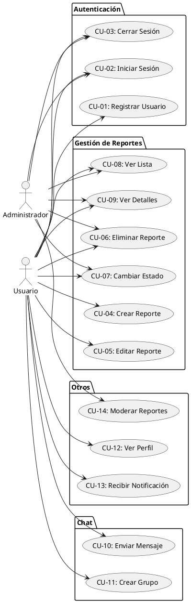
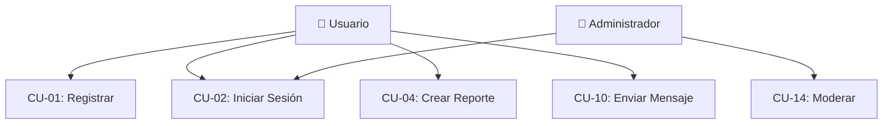

# 🎨 GUÍA RÁPIDA: Herramientas para Crear Diagramas de Casos de Uso

## ⚡ ELECCIÓN RÁPIDA

**Para principiantes**: Usa **Draw.io** (https://app.diagrams.net)  
**Para usuarios avanzados**: Usa **PlantUML** (http://www.plantuml.com/plantuml/uml/)

---

## 📝 MÉTODO 1: Draw.io (RECOMENDADO - Más Fácil)

### Paso 1: Acceder a Draw.io
1. Ve a: **https://app.diagrams.net**
2. O descarga la app desde: **https://github.com/jgraph/drawio-desktop/releases**

### Paso 2: Crear Nuevo Diagrama
1. Click en **"Create New Diagram"**
2. Busca **"UML"** o **"Use Case"**
3. O selecciona **"Blank Diagram"**

### Paso 3: Agregar Elementos UML

#### Agregar Actores:
1. En la barra izquierda, busca **"Actor"**
2. Arrastra el icono de actor al canvas
3. Haz doble click para cambiar el nombre
4. Repite para "Usuario" y "Administrador"

#### Agregar Casos de Uso:
1. Busca **"Use Case"** (óvalo con texto)
2. Arrastra al canvas
3. Haz doble click para escribir el nombre del caso de uso
4. Ejemplos: "Registrar Usuario", "Crear Reporte", etc.

#### Agregar Líneas:
1. Selecciona el actor
2. Verás puntos de conexión (pequeños cuadrados)
3. Arrastra desde un punto hacia el caso de uso
4. Se creará automáticamente una línea

#### Agregar Paquetes (Grupos):
1. Dibuja un rectángulo grande
2. Hazlo transparente (relleno blanco, borde visible)
3. Coloca casos de uso dentro
4. Agrega texto de título arriba

### Paso 4: Personalizar
- **Colores**: Click derecho → Style → Cambia colores
- **Tamaño**: Selecciona y arrastra las esquinas
- **Texto**: Doble click para editar
- **Fuentes**: Panel derecho → Text

### Paso 5: Guardar y Exportar

#### Guardar:
- **Archivo → Guardar como** → Elige ubicación (Google Drive, OneDrive, o Local)

#### Exportar para tu documento:
1. **Archivo → Exportar como → PNG** (para imágenes con buena calidad)
2. O **Archivo → Exportar como → PDF** (para documentos)
3. O **Archivo → Exportar como → SVG** (para calidad vectorial)

### Consejos Draw.io:
- Usa **Ctrl+Z** para deshacer
- Usa **Ctrl+C / Ctrl+V** para copiar/pegar
- Presiona **Shift** mientras arrastras para mantener proporciones
- Usa **Grid** (rejilla) para alinear elementos (View → Grid)

---

## 💻 MÉTODO 2: PlantUML (Basado en Texto)

### Ventajas:
- ✅ Muy rápido una vez que aprendes
- ✅ Se puede versionar en Git
- ✅ Fácil de modificar
- ✅ Genera diagramas automáticamente

### Paso 1: Acceder al Editor
1. Ve a: **http://www.plantuml.com/plantuml/uml/**
2. O instala extensión en VS Code: **"PlantUML"**

### Paso 2: Escribir el Código
Copia y pega este código base:



### Paso 3: Generar el Diagrama
1. Pega el código en el editor
2. El diagrama se genera automáticamente a la derecha
3. Ajusta el código según necesites

### Paso 4: Exportar
1. Click derecho en el diagrama generado
2. **"Save image as..."** → Guarda como PNG
3. O usa el botón de exportación del editor

### Sintaxis PlantUML Útil:
- `actor Nombre` = Crea un actor
- `usecase "Texto"` = Crea caso de uso
- `-->` = Crea flecha
- `package "Nombre" {}` = Agrupa casos de uso
- `left to right direction` = Cambia orientación

---

## 🎯 MÉTODO 3: Mermaid (Intermedio)

### Paso 1: Acceder
Ve a: **https://mermaid.live**

### Paso 2: Escribir Código
Pega este código:



### Paso 3: Exportar
- Click en **"Actions"** → **"Download PNG"** o **"Download SVG"**

---

## 📱 OTRAS OPCIONES

### Lucidchart
- **URL**: https://www.lucidchart.com
- **Registro**: Necesitas cuenta (gratis)
- **Límite**: 3 documentos en versión gratuita

### Creately
- **URL**: https://creately.com
- **Similar a Draw.io** pero con menos opciones gratuitas

### Microsoft Visio (De pago)
- Solo si tienes suscripción Office 365

### yEd Graph Editor (Gratis, descargable)
- **URL**: https://www.yworks.com/products/yed
- Descarga e instala en tu PC
- Más complejo, pero muy poderoso

---

## ✅ CHECKLIST PARA CREAR TU DIAGRAMA

- [ ] Elegir herramienta (recomendado: Draw.io)
- [ ] Crear nuevo diagrama
- [ ] Agregar 2 actores: Usuario y Administrador
- [ ] Agregar casos de uso (óvalos)
- [ ] Conectar actores con casos de uso (flechas)
- [ ] Agrupar casos de uso en paquetes (rectángulos)
- [ ] Revisar que todos los casos estén incluidos
- [ ] Ajustar colores y formato
- [ ] Exportar como PNG o PDF
- [ ] Insertar en tu documento

---

## 🎨 CONSEJOS DE DISEÑO

1. **Colores consistentes**:
   - Actores: Un color (ej: azul)
   - Casos de uso: Otro color (ej: verde)
   - Paquetes: Fondo transparente o muy claro

2. **Distribución**:
   - Actores a la izquierda
   - Casos de uso en el centro/derecha
   - Paquetes agrupando casos relacionados

3. **Textos claros**:
   - Fuente legible (Arial, Calibri)
   - Tamaño adecuado (no muy pequeño)
   - Nombres descriptivos

4. **Espaciado**:
   - Deja espacio entre elementos
   - No amontones todo junto
   - Usa alineación para orden

---

## 📄 INSERTAR EN DOCUMENTO WORD/GOOGLE DOCS

### En Microsoft Word:
1. **Insertar → Imagen → Desde archivo**
2. Selecciona el PNG/PDF exportado
3. Ajusta tamaño si es necesario
4. Opcional: Click derecho → "Envolver texto" → "Cuadrado"

### En Google Docs:
1. **Insertar → Imagen → Subir desde el equipo**
2. O arrastra la imagen directamente
3. Ajusta tamaño desde las esquinas

### En LaTeX (si usas):
```latex
\begin{figure}[h]
    \centering
    \includegraphics[width=0.8\textwidth]{diagrama_casos_uso.png}
    \caption{Diagrama de Casos de Uso - SafeArea}
    \label{fig:casos_uso}
\end{figure}
```

---

## 🆘 SOLUCIÓN DE PROBLEMAS

**Problema**: El diagrama se ve borroso  
**Solución**: Exporta con mayor resolución (300 DPI o más)

**Problema**: Los elementos no se alinean  
**Solución**: Activa la rejilla (Grid) en Draw.io

**Problema**: El texto se corta  
**Solución**: Ajusta el tamaño del óvalo/casillo

**Problema**: PlantUML no genera diagrama  
**Solución**: Revisa la sintaxis, debe terminar con `@enduml`

---

¡Éxito creando tus diagramas! 🎉

